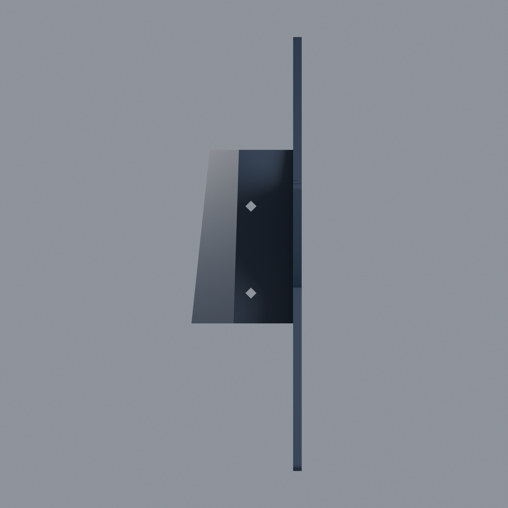

# Roanoke Star Tree Topper

 

 

**A research-informed miniature of Roanoke’s Mill Mountain Star** 
200 mm · two colors · one print · no assembly

The Roanoke Star is one of Virginia’s most recognizable night-time landmarks. This tree topper translates its layered neon silhouette into a carefully documented, print-in-place object: a dark structural star, three white backing bands, 130 individually outlined tube sections, and an integrated rear mount for a Christmas-tree leader.

> **Cover note:** The cover is an AI-generated product illustration based on the finished model and owner-supplied print photographs. The project renders and physical-print evidence below are the model’s actual release assets.

## A Christmas landmark since 1949

The Star’s Christmas connection is original to its story. The Roanoke Merchants Association commissioned it for the **1949 Christmas season**, and it was first illuminated on **November 23, 1949**. What began as a seasonal attraction became a permanent symbol above the city. The City of Roanoke records the Star’s height as **88.5 feet**. [City of Roanoke history](https://www.roanokeva.gov/1329/Roanoke-Star)

Roy C. Kinsey Sign Company built the sign with Roanoke Iron & Bridge Works providing the steel structure. Historical accounts credit Robert Little with the design. The full-scale Star was assembled flat on the ground at Roanoke’s airport, taken apart, transported up Mill Mountain, and erected on its tower. [1982 historical account, pp. 88–90](https://www.virginiaroom.org/digital/files/original/67/6354/JHSWV_11_02_1982.pdf) · [WDBJ interview preserved by Virginia Tech](https://scholar.lib.vt.edu/VA-news/WDBJ-7/script_archives/99/1199/112899/112899.m.htm)

The landmark is not a single outline. It is **three nested structural stars** carrying multiple neon sets. Historical descriptions give the Star an 88.5-foot height, a 100-foot supporting tower, a 6.5-foot-deep concrete base, and roughly 2,000 feet of neon tubing. The City’s public-art record and site descriptions confirm the three-star construction. [City description](https://www.roanokeva.gov/1329/Roanoke-Star) · [City art catalog](https://www.artworkarchive.com/profile/roanoke-arts/artwork/roanoke-star)

That layered construction is the heart of this design. The three white bands are the topper’s visual translation of the landmark’s nested neon faces; the dark gaps and rounded tube ends make each run read as an individual piece of neon instead of a single printed line.

## The design in one glance

| | |
|---|---|
| **Scale** | 200 mm tall · 190.96 mm wide · 50.84 mm deep |
| **Face** | Three white star bands with 130 individually outlined tube sections |
| **Construction** | Print-in-place body, face details, and integrated tree socket |
| **Material** | Two compatible PLA colors; dark structural body with white tubes and backing |
| **Target machine** | Bambu Lab A1 with AMS lite · 0.4 mm nozzle · 0.20 mm layers |
| **Assembly** | None; the star and rear mount print as one object |

## From photographs to a printable star

The geometry was developed from municipal records, historical accounts, archival finding aids, aerial views, night photographs, close-up tube studies, and more than fifteen reference views. The research deliberately separates what a photograph can show from what it cannot: an observation-deck photograph looking upward compresses vertical spacing, while an oblique view makes one side appear wider than the other. Those perspective effects are documented in the [perspective audit](research/ACCURACY_AUDIT.md).

The documented 88.5-foot height anchors the scale. Published widths disagree: the Smithsonian inventory records approximately **88.5 × 84.5 feet**, while the City’s art catalog lists **1062 × 1200 inches** without a dimensioned elevation that identifies the axes. This model uses the 84.5/88.5 proportion as its photographic reconstruction basis. Compare the [Smithsonian inventory](https://siris-artinventories.si.edu/ipac20/ipac.jsp?booklistformat=&profile=ariall&session=1761P49582NO9.272492&uri=full%3D3100001~%21334963~%210) with the [City art catalog](https://www.artworkarchive.com/profile/roanoke-arts/artwork/roanoke-star); the exact construction is inspectable in the [angle worksheet](research/ANGLE_WORKSHEET.md), [coordinate table](research/candidate_angles.csv), and [parallel-path correction notes](research/PARALLEL_PATH_CORRECTION.md).

The model does not claim to recover an unpublished engineering drawing or the landmark’s complete electrical tube schedule. It is a photo-informed interpretation with explicit dimensions, repeatable construction scripts, and a clear record of the sources and assumptions. The original-plan search examined the Virginia DHR National Register nomination, NPS asset records, the City’s public Engineering plan repository, Virginia Room finding aids, and restoration-report references; no original dimensioned Star elevation or shop drawing was located in the material reviewed. See the [archive search record](research/PLAN_SEARCH.md).

### The tube language

Each nested outline uses a constant inward offset, so corresponding runs remain parallel through every point and recess, including the two lower side interior angles. The [spacing review](research/SPACING_REVIEW.md) compares those offsets with the primary aerial reference. Rounded ends and deliberate dark breaks suggest separate neon lengths, while continuous bends carry the pattern around the star’s corners. A 0.6 mm dark outline keeps the white tube sections legible at FDM scale.

The three broad white backing bands leave approximately **1.6 mm of dark space** between star groups. The tubes and bands are flush inlays, 1.0 mm deep, rather than fragile raised details. White model details occupy the first five layers against the build plate; the dark body, outline, and integrated socket continue above them.

Close photographs show interruptions along straight runs and illuminated bends around corners. A high-resolution Commons photograph provided observations of breaks near the quarter points of one long run; Ben Schumin’s close-up series supplied additional night views. Those observations informed the rounded sections and dark gaps, while symmetry and repetition complete the printable pattern. The **130-section count describes this print**, rather than an inventory of the landmark’s glass tubes or electrical circuits. See the [tube-layout study](research/TUBE_LAYOUT.md), [recorded image observations](research/tube_joint_observations.json), [Schumin close-up series](https://www.schuminweb.com/photography/roanoke-star-night/), and [Commons photograph](https://commons.wikimedia.org/wiki/File:Mill_Mountain_Star_Neon_Lights.JPG).

<table>
<tr>
<td></td>
<td></td>
</tr>
<tr>
<td><em>Front: the layered neon pattern</em></td>
<td><em>Three-quarter: one-piece construction</em></td>
</tr>
<tr>
<td></td>
<td></td>
</tr>
<tr>
<td><em>Side: shallow face, deep socket</em></td>
<td><em>Rear: recessed attribution</em></td>
</tr>
</table>

## Download the model

The design is published on MakerWorld with a dedicated A1 profile:

**[Open the MakerWorld model](https://makerworld.com/en/models/3336030-roanoke-star-christmas-tree-topper-2-color)** · **[Open the A1 two-color profile](https://makerworld.com/en/models/3336030-roanoke-star-christmas-tree-topper-2-color#profileId-3789238)**

| File | Use |
|---|---|
| **[Two-color 3MF](print_in_place/roanoke_star_A1.3mf)** | The recommended Bambu Studio project, with two filaments and explicit part assignments. |
| [Editable Blender source](print_in_place/roanoke_star_A1.blend) | Final material meshes, hidden reference paths, and embedded research, license, and validation reports. |
| [Dark body STL](print_in_place/body_material.stl) + [white face STL](print_in_place/white_tube_material.stl) | Alternative material meshes with a shared origin; import together as parts of one object. |
| [Design report](print_in_place/DESIGN_REPORT.md) | Dimensions, mount geometry, material layout, and validation results. |

The finalized [MakerWorld listing copy](publishing/makerworld/LISTING.md) and its [cover illustration](publishing/makerworld/cover.png) are included with the release assets. Personal print photographs used on the listing are intentionally not redistributed here.

## Printing, kept practical

Open the 3MF **as a project** in Bambu Studio. Filament 1 is the dark body and filament 2 is the white face detail; map those project filaments to the appropriate AMS lite spools. Keep the decorated face flat against the build plate and use the included A1 0.4 mm nozzle profile at 0.20 mm layer height.

The project uses four walls, five top and bottom layers, 15% gyroid infill, Arachne walls, and a prime tower, with supports disabled. View layers 1–5 in the slicer to see the two-color face; the full-height view looks mostly dark because the decorated face is against the bed. Select your actual build plate; the included setting is Textured PEI.

The integrated socket is 80 mm long, with nominal circular clearance tapering from **Ø34 to Ø22 mm**. Measure your tree leader before printing. The rear diamond holes accept optional retaining ties when a tree needs extra support.

The validated slice estimates **2 h 47 min and 70.5 g of PLA**, including purge and prime-tower material: 58.6 g dark and 11.9 g white. Your filament profiles and printer settings can change those estimates. The [slicer report](print_in_place/slicer_validation.json) records the exact package checked and the settings read from its exported toolpath.

The owner supplied four photographs of a successful physical print of the revised two-color face. They show the dark body, three white backing bands, and individual white tube sections. The exact slicer profile used for those photographs and post-print mechanical tests were not recorded, so socket fit, strength, and tree retention remain unverified. See the [release status](print_in_place/RELEASE_STATUS.json) for the scope of that evidence.

## Geometry and release validation

The release is checked as a model package, not only as a render:

- Watertight material meshes with consistent winding and no duplicate or zero-area triangles.
- One connected dark body and 133 white solids—130 tube sections and three backing bands—that together form a single connected print.
- Zero non-adjacent triangle-intersection candidates in either material mesh.
- Material coverage matching the complete outer solid within export precision.
- Clearance for the nominal tapered socket mandrel and geometry within the chosen 45° overhang limit.
- Recessed lettering verified for floor, depth, and clearance from the socket.
- A standard 3MF geometry round trip, two filament definitions, and explicit part-to-filament assignments.
- Native Bambu slicing with both colors, preserved process settings, and white extrusion confined to Z = 0.2–1.0 mm.
- Byte-for-byte agreement between the Blender material meshes’ STL exports and the downloadable material STLs.

See the [mesh report](print_in_place/mesh_validation.json), [intersection results](print_in_place/self_intersections.json), [scene/export check](print_in_place/scene_export_validation.json), and [rebuild guide](scripts/REBUILD.md).

## Explore the repository

| Directory | Contents |
|---|---|
| [`print_in_place/`](print_in_place/) | A1 model, material meshes, Blender scene, previews, and validation reports |
| [`scripts/`](scripts/) | Reproducible geometry construction, packaging, and checks |
| [`research/`](research/) | Sources, photograph analysis, angle measurements, and archival research |
| [`publishing/makerworld/`](publishing/makerworld/) | Published listing copy and cover-art provenance |

`main` contains the integrated single-print design shown above. Superseded models and development drafts remain available in Git history.

## Credits and license

Project by [christopherrbrown3](https://github.com/christopherrbrown3). Historical and visual references include the City of Roanoke, Virginia DHR, Roanoke Public Libraries’ Virginia Room, the Smithsonian inventory, Virginia Tech’s WDBJ archive, Ben Schumin, and Wikimedia Commons contributors. See the [source credits](research/SOURCES.md), [photograph inventory](research/GEOMETRY_REVIEW.md), and [supplied-reference provenance](research/user_provided/PROVENANCE.json).

The original model design, geometry data, and downloadable Blender, STL, and 3MF files are licensed under **[Creative Commons Attribution–NonCommercial–ShareAlike 4.0 International](https://creativecommons.org/licenses/by-nc-sa/4.0/)**. You may share and adapt the model for noncommercial purposes with attribution; adaptations must use the same license. See [LICENSE](LICENSE) for the complete terms.

Suggested attribution: **Roanoke Star Tree Topper by [christopherrbrown3](https://github.com/christopherrbrown3) · [christopherbrown.io](https://christopherbrown.io) · CC BY-NC-SA 4.0**. Identify changes when sharing an adaptation.

This license does not relicense third-party reference materials or the historical landmark itself. The back of the model carries recessed `christopherbrown.io` lettering.
