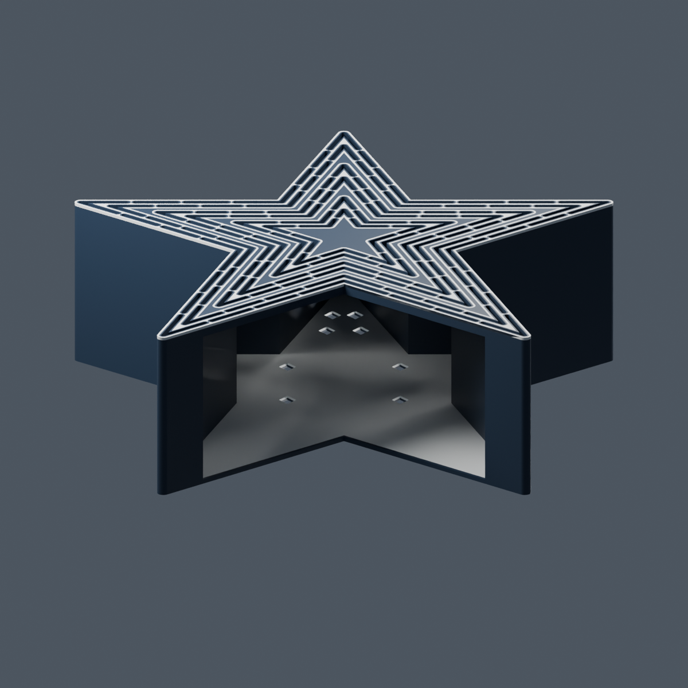
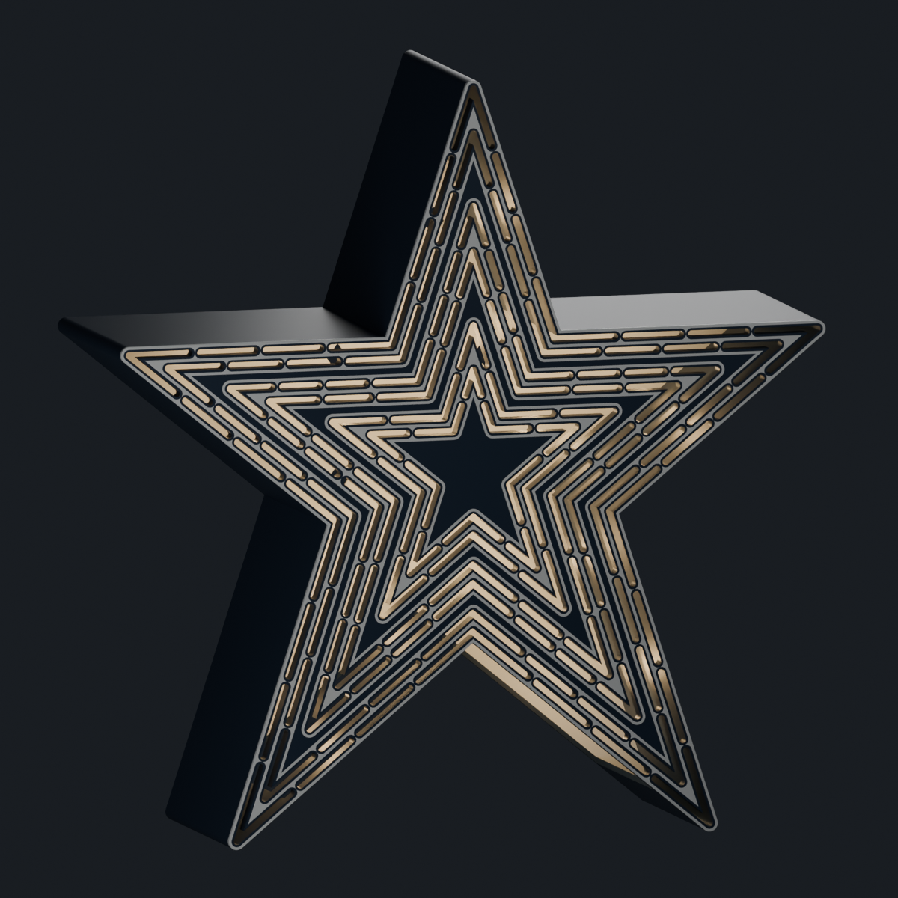

**Roanoke Star — hollow pentagrammic prism variant**

This is a separate, one-piece tree topper based on the existing A1 model. The original release files are preserved. The front outline, three white backing bands, dark outlines, and all 130 tube positions come from the existing construction profiles. The tube sections are now open slots leading into a hollow star-shaped prism. The old attachment socket is omitted.

| Feature | Dimension |
|---|---:|
| Upright height × width × depth | 200 × 190.96 × 60 mm |
| Front wall | 4.0 mm |
| Side wall | 1.2 mm |
| Rear wall | 1.6 mm |
| Open tube slots | 130, nominally 1.8 mm wide |
| Lower inlet width × front-to-back clearance | 100 × 54.4 mm |
| Clear width at the star's waist | About 78 mm |
| Rear vents | Eight diamond openings, 192 mm² total |
| Solid PLA estimate, before brim, support, and purge | 126 g |

The inlet follows the lower V between the two bottom points. Its 100 mm width is intended to admit a gathered bundle of compressible branches and lights. It is not a circular 100 mm bore: the star narrows inside. A tapered 100 mm long tree-leader reference, 33.9 mm wide at its base and 13.9 mm at its tip, clears the model in the digital collision check.

A white inner rear surface reflects light toward the slots. The separate white mesh is a filament region in the same fused print; there is no removable back, inserted diffuser, or assembly operation. Arrange the tree's existing light string through the lower opening before seating the topper. Actual brightness and coverage depend on bulb positions and foliage.

The lighting preview is a Blender simulation with illustrative internal lights. It is not a measurement of a real light string. Start physical evaluation with LED or fairy lights. LEDs generally produce less heat than older lighting technologies ([Australian Government lighting guidance](https://www.energy.gov.au/households/household-guides/seasonal-advice/summer?page=7)). Incandescent compatibility has **not** been heat-tested; bulb clearance and ventilation do not establish it. Tree retention, long-term strength, and real illumination uniformity also remain untested.

**Files**

- `roanoke_star_prism.blend`: editable Blender scene, built through Blender MCP. Print geometry is separated from the studio, hidden exterior reference, and optional illumination demonstration.
- `roanoke_star_prism_A1.3mf`: one multipart object with navy shell on filament 1 and white face bands/interior reflector on filament 2. Intended for the A1 and AMS lite, with a 45° print tilt, 0.4 mm nozzle, and 0.20 mm layers.
- `roanoke_star_prism_A1_single_color.3mf`: same fused geometry in one white filament, with no prime tower. Geometry and package round trip checked; its GUI slice remains pending.
- `roanoke_star_prism.stl`: complete single-piece geometry for a monochrome print. White bands lose their color distinction when printed this way.
- `dark_shell.stl` and `white_details.stl`: alternative two-material imports. Import together as parts of one object and preserve their shared origin.
- `previews/`: front, rear, three-quarter, lower-opening, and illustrative lighting views.
- `parameters.json`, `profiles.json`, and the Python sources: inspectable dimensions, geometry preparation, Blender construction, and independent validation/packaging.
- `mesh_validation.json`, `canonicalization_report.json`, and `blender_validation.json`: digital geometry evidence.

The tilted model occupies approximately 191 × 184 × 184 mm. The tilt keeps the planar faces and extruded walls within a 45° surface-overhang envelope, avoiding a large horizontal interior roof. A wide adhesion brim is included for the two lower tips, and automatic tree support is enabled from the build plate. Review the slice before printing. The slanted two-color face requires color changes through many layers and can consume substantially more purge material than the original face-down design.

The completed two-color slice in Bambu Studio 02.05.00.66 estimates **42 h 32 min and 661.49 g**, including 459.97 g of purge and 66.99 g for the tower, with 910 filament changes. The model itself is 118.95 g in the slicer estimate. No print was sent. The G-code hash, package hash, settings, and review scope are saved in `slicer_validation.json`; generated G-code stays local and is ignored by Git.

**Rebuilding**

Run `python3 pentagrammic_prism/prepare_profiles.py` from the repository root. This creates the simple source extrusions in `construction/` without modifying the original profiles or release. The preparation script requires NumPy, Trimesh, Shapely, and mapbox-earcut.

In a fresh Blender scene connected through MCP, send the contents of `build_blender.py` to `execute_blender_code`, followed by `setup()` and `build_shell()`. For the next call, resend the function definitions, call `restore()`, then `partition_colors()` and `finish()`. The code uses native imports, booleans, rendering, and saving compatible with MCP safe mode. It does not need Python file access within Blender. If changing dimensions, update the preparation configuration and pass the corresponding parameter dictionary as `C` before the build calls.

Run `canonicalize_exports.py` locally after the native exports. Return the canonical meshes to their matching Blender objects using native STL import, preserving the materials and scene properties; re-export the material meshes. Run Blender's BVH check with zero extra tolerance. The supplied final meshes have zero nonadjacent intersection candidates. Then run `python3 pentagrammic_prism/validate_and_package.py` to check the files and rebuild the 3MF. The validation script also requires Manifold3D.

The independent checks verify watertight material meshes, a single connected fused shell, preserved face footprints, 130 matching apertures, cavity and mouth clearance, material coverage, a collision-free leader reference, and 3MF round-trip geometry. They do not substitute for a physical print or thermal test. Slicer evidence, when present, is recorded separately in `slicer_validation.json`.

Original model and this adaptation: christopherrbrown3 / christopherbrown.io, **CC BY-NC-SA 4.0**. See the repository's `LICENSE`, also embedded in the 3MF.
