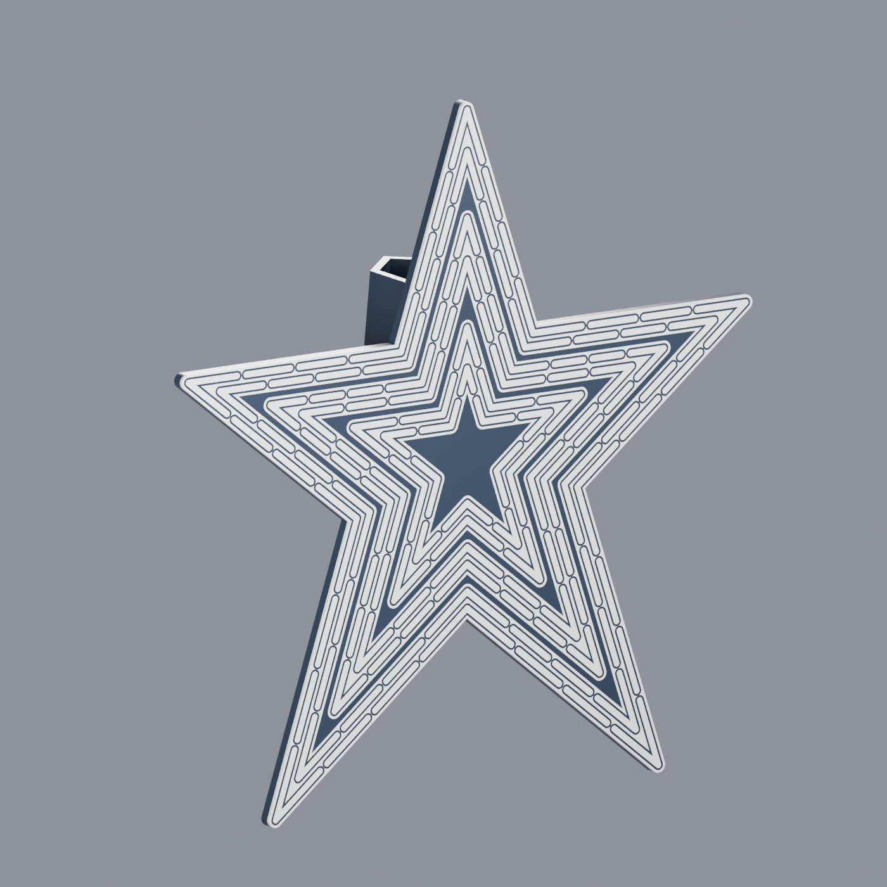

# Roanoke Star A1 tree topper

A single, two-color print for the Bambu Lab A1 with AMS lite: three white backing bands, 130 individually outlined tube sections, an integral tree socket, and recessed `christopherbrown.io` attribution on the back. No assembly is required.

## Face and spacing

The star prints face-down. White tube sections and white backing bands occupy the first 1.0 mm; the surrounding dark material continues into the 4.0 mm body and rear socket. A 0.6 mm dark outline separates each white tube from its backing. Contrast defines the tubes while every front surface stays on the same plane.

All six tube paths are perpendicular offsets of the same ten edge lines. Corresponding runs remain parallel through convex tips and concave notches. The paths contain 30, 30, 30, 20, 10, and 10 tube sections. Their rounded ends and mirrored breaks interpret the photographed neon pattern; they are not a recovered historical tube schedule.

| Feature | Dimension |
|---|---:|
| Tube width / white inlay depth | 1.8 / 1.0 mm |
| Break between consecutive tube sections | 1.20 mm |
| Dark outline around each tube | 0.60 mm |
| Clear tube gaps within the three pairs | 1.937 / 1.992 / 1.865 mm |
| Clear tube gaps between paired groups | 4.195 / 4.267 mm |
| Clear gaps between the white backing bands | 1.595 / 1.667 mm |
| Body thickness | 4.0 mm |

The [spacing review](../research/SPACING_REVIEW.md) compares the geometry with the primary aerial photograph and supplied research. It supports retaining the tube positions. The backing-band width and dark outlining are choices for readability at print scale, not surveyed landmark dimensions.

## Envelope and integral socket

The complete print measures **190.960 × 199.997 × 50.836 mm** in X, Y, and Z. The front is at Z = 0, and the socket grows upward from the back. Its footprint stays behind the star's silhouette.

| Socket feature | Specification |
|---|---:|
| Axis | Star Y axis |
| Openings | Y = −32 and +48 mm |
| Length | 80 mm |
| Nominal circular clearance, lower / upper | Ø34 / Ø22 mm |
| Minimum wall | 2.4 mm |
| Bore center depth | Z = 23.4 mm |
| Roof | Two 45° facets |
| Transverse tie holes | 5 mm diamond diagonal, at Y = −18 and +22 mm |

The bore has a flat floor, vertical sides, and a pitched roof. It contains the nominal circular tapered mandrel without a horizontal ceiling. The socket overlaps the body by 0.2 mm, forming one connected dark solid. The diamond-shaped tie holes also have sloping roofs. Branch shape and fit vary; these dimensions describe available space rather than a universal tree fit.

## Recessed attribution

`christopherbrown.io` is debossed into the exposed upper-right shoulder when viewed from the back. Its 47.5 × 4.523 mm footprint is approximately 8 mm clear of both the socket and the outline. The 0.6 mm recess ends at Z = 3.4 mm, leaving 2.4 mm of material above the front inlays. Arial Bold is converted to mesh during construction; the font file is not embedded or redistributed.

## Two-color print project

The 3MF contains one multipart object with explicit Bambu filament assignments:

| Project filament | Geometry |
|---|---|
| 1 — dark navy or black PLA | Structural body, socket, and tube outlines |
| 2 — white PLA | 130 tube sections and three backing bands |

Both filaments feed the A1's single nozzle through AMS lite. The included configuration uses a 0.4 mm nozzle, 0.20 mm layers, four walls, five top and bottom layers, 15% gyroid infill, Arachne wall generation, supports disabled, and a prime tower. Select the actual build plate before slicing. White material is confined to the first 1.0 mm; the later body and socket print in the dark filament alone.

The earlier generic 3MF stored two display colors but omitted Bambu's part-level filament assignments. Bambu Studio imported both parts with filament 1. The exporter now records each part's `extruder` in `Metadata/model_settings.config` and includes two filament definitions. Part IDs match the referenced mesh resources, as required by [Bambu's 3MF importer](https://github.com/bambulab/BambuStudio/blob/master/src/libslic3r/Format/bbs_3mf.cpp).

Process settings also need native override metadata. Without it, Bambu Studio can replace custom values with the named system preset's defaults when opening the project. The exporter includes `different_settings_to_system`: a list of explicitly retained settings for the process, followed by entries for each filament and the printer. Its format was checked against a project saved by Bambu Studio and the official [preset-loading implementation](https://github.com/bambulab/BambuStudio/blob/master/src/libslic3r/PresetBundle.cpp). This preserves the intended walls, infill, and support settings when the system preset is resolved.

The material STLs remain an alternative: import both together as parts of one object, preserving their shared origin, then assign the two colors. The geometry-reference STL contains the complete exterior without the contrasting face pattern.

## Validation and print evidence

The [mesh report](mesh_validation.json) records independent checks against the construction profiles:

- Dark material: one watertight solid, 87,528 triangles, 77.8722 cm³.
- White material: 133 watertight solids, 77,964 triangles, 8.30384 cm³: 130 tube sections and three continuous backing bands.
- Combined exterior: one watertight solid, 9,276 triangles, 86.1760 cm³.
- Zero duplicate or zero-area triangles, and zero non-adjacent triangle-intersection candidates in both materials.
- Material overlap is negligible at numerical precision. The material union differs from the complete exterior by approximately 0.00015 mm³.
- The exported white face differs from its prepared footprint by 0.00857 mm² across 8,303.84 mm².
- The engraving-floor footprint matches the prepared lettering; minimum socket clearance is 7.947 mm.
- Zero collision with the tapered mandrel at the stated 0.05 mm radial allowance, and zero measured above-bed surface area beyond the chosen 45.05° overhang threshold.

Coplanar triangulation was canonicalized through Manifold, returned to the Blender scene, and checked without increasing intersection tolerances. The finalized Blender material meshes export byte-for-byte identical STLs to the downloadable material files. The [scene/export check](scene_export_validation.json) records both hashes and verifies that each mesh uses its intended material slot.

The 3MF is reopened programmatically to check its geometry, one-object structure, two filament definitions, part assignments, and explicit process overrides. The exact generated package was then opened and sliced in Bambu Studio 02.05.00.66 on macOS without editing the imported process or filament assignments. Each of the first five layers was visually inspected: the white bands, individual tube outlines, and separation at both lower interior corners remain visible. The sixth-layer transition to the dark body and the completed socket roof were also inspected.

An independent audit of the exported G-code confirms the A1 0.4 mm profile, 0.20 mm layers, four walls, five top and bottom layers, 15% gyroid, Arachne, Textured PEI, supports disabled, and a prime tower. Both colors occur in the model; white deposition is confined to Z = 0.2–1.0 mm, and dark material continues through Z = 50.8 mm. The 254-layer slice estimates 2 h 47 min 24 s and 70.52 g total filament, including purge and tower material. The [slicer report](slicer_validation.json) identifies the package and G-code by SHA-256; the [release status](RELEASE_STATUS.json) records the validation scope.

The owner reported a successful physical print of the earlier tube-only STL version. The white backing bands and recessed signature are subsequent changes and have not yet been physically printed. No branch-retention or load test has been performed. Digital checks do not establish those properties or verify the landmark's original dimensions.

## License and editable source

The model and geometry are licensed **[CC BY-NC-SA 4.0](../LICENSE)**, with attribution to [christopherrbrown3](https://github.com/christopherrbrown3) and [christopherbrown.io](https://christopherbrown.io). The license is included in the 3MF and model metadata. Third-party references retain their original terms.

The finalized Blender source and matching material meshes are alongside this report. Use the STL or 3MF exports for printing. The Blender file includes editable reference paths and embedded copies of the research, license, construction scripts, and validation reports. The [rebuild guide](../scripts/REBUILD.md) describes construction, export, packaging, and validation. [Research sources](../research/SOURCES.md), the [angle worksheet](../research/ANGLE_WORKSHEET.md), and the [archive search](../research/PLAN_SEARCH.md) document the evidence and its limits.
