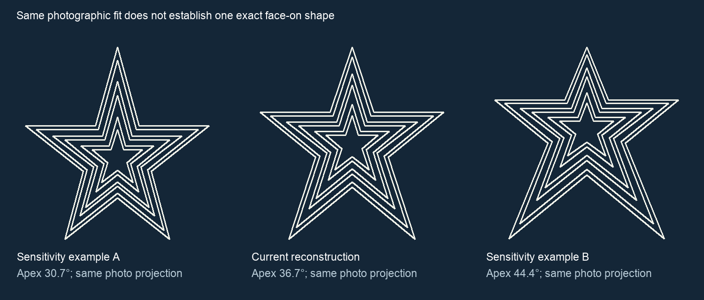

# Accuracy audit — 10 September 2026

**Finding: the present reconstruction cannot be called a perfect representation.** The user has not accepted its proportions. Earlier statements that the geometry was final or that the independent overlay established accuracy were too strong.

## The main methodological weakness

The city photograph was traced accurately in image space, but the inferred face-on geometry depends on assumed symmetry, level shoulders, approximate parallelism between paired tube edges, and a published overall aspect ratio. The pair-parallelism assumption has not been established by a drawing or measured landmark dimensions.

The later drone comparison fitted a free projective transform. Such a transform can absorb changes in the underlying face-on proportions. A lower reprojection error therefore supports image-space consistency, but does **not** independently prove correct apex angle, shoulder height, lower-leg length, or nested spacing.

`audit_projective_ambiguity.py` constructs three example shapes with the same bilateral symmetry, horizontal shoulders, and 84.5/88.5 overall aspect ratio. Their apex angles are 30.68°, 36.66°, and 44.43°. Each maps exactly back to the current reconstruction through a projective transform, and therefore can retain the same photo reprojection when the camera homography is refitted. Numerical round-trip error is below 5×10⁻¹⁴ mm.

These examples are a mathematical counterexample, **not a confidence interval and not proposed replacement designs**. Additional physical constraints, including verified edge parallelism or calibrated camera geometry, could distinguish them. The current evidence has not established those constraints strongly enough to claim exactness.

## What is actually supported

- The [City of Roanoke](https://www.roanokeva.gov/1329/Roanoke-Star) gives the star height as 88.5 feet and describes three nested frames carrying multiple neon tube sets.
- The [Smithsonian inventory](https://siris-artinventories.si.edu/ipac20/ipac.jsp?booklistformat=&profile=ariall&session=1761P49582NO9.272492&uri=full%3D3100001~%21334963~%210) gives **approximate**, not survey-certified, dimensions of 88.5 × 84.5 feet.
- The [city art catalog](https://www.artworkarchive.com/profile/roanoke-arts/artwork/roanoke-star) records 1062 × 1200 inches, or 88.5 × 100 feet, without a dimensioned elevation explaining the axes. The width-related discrepancy is unresolved. The current 84.5/88.5 aspect ratio is an assumption supported by one approximate inventory, not an independently verified measurement.
- The city aerial visibly contains six illuminated contours grouped in three pairs in its all-white configuration. This does not establish the total number or exact layout of all physical neon tubes in every color mode.
- Low-angle and oblique photographs require perspective treatment. Copying their apparent proportions directly would also be wrong.

## Additional searches completed

Searches covered original 1949 plans/blueprints, Kinsey drawings, CAD, engineering/renovation plans, historic nominations, the Virginia Room finding aid, and later inspection/maintenance records.

The [DHR nomination](https://www.dhr.virginia.gov/VLR_to_transfer/PDFNoms/128-0352_Roanoke_Star_1999_Final_Nomination.pdf) supplies history and overall dimensions, but its available exhibits are location/site maps, not a dimensioned star elevation. The [1982 first-person account by Edward C. Moomaw](https://www.virginiaroom.org/digital/files/original/67/6354/JHSWV_11_02_1982.pdf) identifies the construction participants but did not provide a usable coordinate drawing in the material examined. No public dimensioned star elevation was located in these searches; this is not a claim that no drawings exist.

## Evidence needed to finish an exact reconstruction

The best next source is a dimensioned front elevation or fabrication drawing from the City, Kinsey archive, or restoration/inspection records. Useful measurements include the heights and horizontal offsets of each frame's ten vertices, tube offsets within each frame, and the distinction between the steel/aluminum silhouette and tube centerlines.

A calibrated survey or a sufficiently controlled photograph set can also constrain the geometry, but should report camera calibration, perspective model, measurement residuals, and uncertainty. A drone gimbal-angle tag by itself is insufficient.

The repository retains the current candidate and full provenance. No further shape has been selected merely because it looks more plausible, and no outside organization has been contacted.

## Update — 12 September 2026

The [new user research review](USER_RESEARCH_REVIEW.md) retains the three-pair topology and identifies the supplied 60° apex as an unverified photo hypothesis. It corrects the proposed 1.8× **clear-gap** rule: the supplied pixels describe centerline intervals, so that number is not a clear-gap ratio. The [angle worksheet](ANGLE_WORKSHEET.md) exposes all candidate angles with explicit conventions. The [plan search](PLAN_SEARCH.md) identifies specific incomplete archival records and unsent requests; no dimensioned Star elevation was found.

The continuous-insert candidate's pending Blender repair has now passed the existing digital mesh and assembly checks, including zero self-intersection candidates. The user subsequently requested individually visible tube sections, so a segmented-tube revision is in progress. The repair does not resolve landmark geometry.
