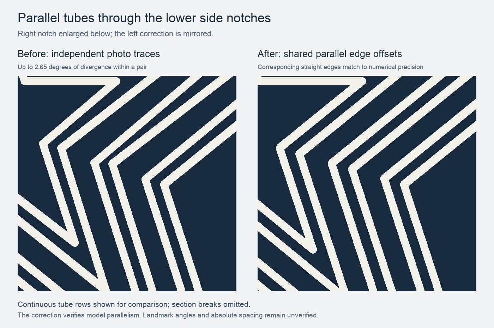

# Parallel tube-path correction — 13 September 2026

The user identified visible convergence at the two lower side interior corners. A numeric audit confirmed that the independently traced paths did not have matching directions. This was a modeling defect, not merely a perspective effect in the render.

The comparison enlarges the lower-right notch at the same scale in both panels. The left notch is its mirror. Continuous tube rows are shown to make direction and spacing visible; the printed design still has 130 individually separated tube sections.

## What was wrong

Edges are numbered clockwise from the top tip. Edge 3 runs from the right outer tip into the lower-right notch; edge 4 leaves that notch toward the lower-right tip. The matching left edges are 8 and 7.

| Pair | Prior edge-3 direction mismatch | Prior edge-4 mismatch | Prior edge-3 normal centerline gap range |
|---|---:|---:|---:|
| Paths 1 / 2 | 0.448° | 0.153° | 3.460–3.996 mm |
| Paths 3 / 4 | 2.649° | 0.246° | 2.668–4.848 mm |
| Paths 5 / 6 | 2.476° | 0.488° | 3.291–4.393 mm |

The gap ranges are endpoint projections onto the outer row's normal. They are centerline measurements, not clear edge-to-edge gaps. The two inner pairs visibly opened out along the diagonal into the notch.

## How it was corrected

All six paths now use the same ten edge directions. The outer candidate path provides the reference lines. For every nested path, those lines move inward by a single perpendicular distance; each new vertex is the intersection of its two neighboring offset lines. This keeps corresponding edges parallel and carries the constraint through both convex tips and concave notches.

Each path's offset is the least-squares fit to its previous ten vertices, measured in model millimeters. This retains a traceable relationship to the photographic reconstruction while removing its inconsistent directions. It is a design regularization, not a new measurement of the landmark. Inner vertices move by up to 4.108 mm; this is a correction to the whole nested-path construction, not just a visual adjustment to two endpoints.

| Path | Inward normal offset from outer path |
|---|---:|
| 1 | 0.000000 mm |
| 2 | 3.737158 mm |
| 3 | 9.731944 mm |
| 4 | 13.523626 mm |
| 5 | 19.590193 mm |
| 6 | 23.254967 mm |

With the 1.8 mm tube width, the straight-edge clear gaps within the three pairs are 1.937, 1.992, and 1.865 mm. The two wider gaps between pairs are 4.195 and 4.267 mm. The smallest separation between any two complete segmented white regions is 1.200 mm, at a straight-run tube interruption.

The prepared profiles have a maximum corresponding-edge direction error below 3 × 10⁻¹⁴ degrees and a normal-offset error below 2 × 10⁻¹⁴ mm. These numbers describe floating-point consistency, not achievable printer precision. Every path is a valid simple polygon and is mirrored left to right.

## Evidence and limits

The construction and measurements are reproducible with [prepare_a1_print_in_place.py](../scripts/prepare_a1_print_in_place.py). The original independently traced paths remain in [final/profile_measurements.json](../final/profile_measurements.json), and the corrected coordinates and complete fit diagnostics are in [the current profile report](../print_in_place/profile_measurements.json). The [angle worksheet](ANGLE_WORKSHEET.md) and [CSV](candidate_angles.csv) now describe the corrected model paths.

Parallelism is established for the model. The absolute outline angles, frame positions, and joint schedule remain provisional because no dimensioned elevation or original tube-layout drawing has been located. The fit does not turn a photographic reconstruction into a surveyed replica.

The Blender/STL/3MF rebuild and rendered inspection are pending access to the unlocked Mac. Existing binary exports and renders still show the 12 September geometry until that rebuild is completed.
