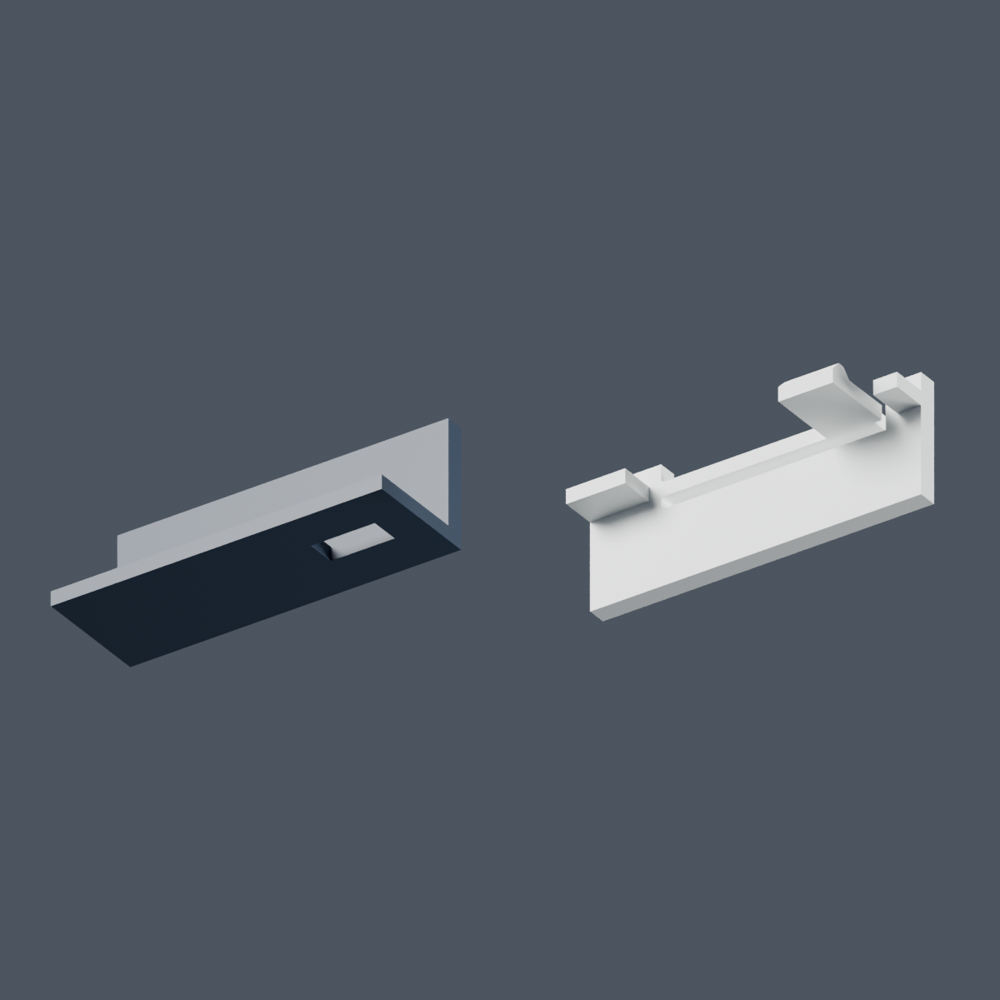
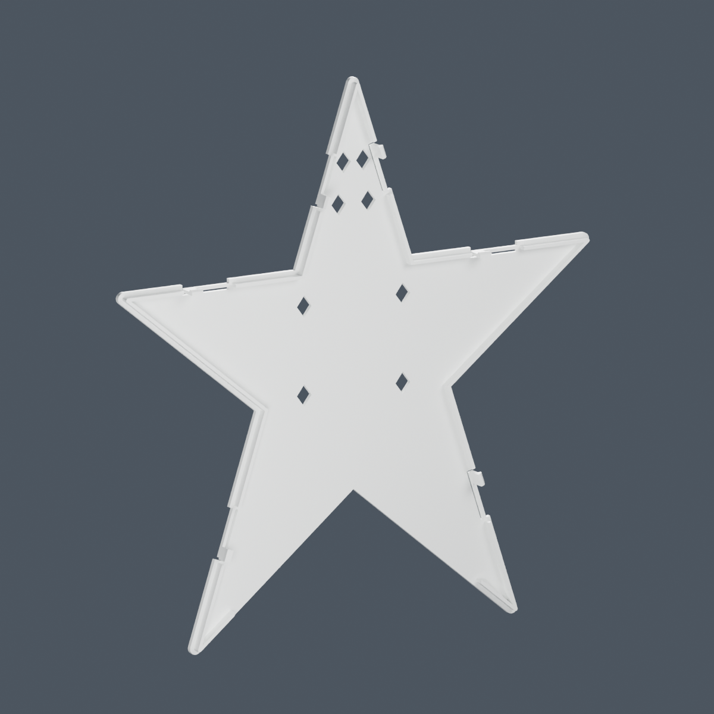

**Roanoke Star — snap-back prism experiment**

This is a separate two-piece experiment based on the one-piece prism checkpoint, commit `fcb757d`. The original release and the committed prism files are preserved. It retains the original 200 mm face, three white bands, and 130 light apertures. The star is 60 mm deep with the same 100 × 54.4 mm lower opening; the cavity narrows to about 78 mm at its waist.

**Use the [full two-dot revision](two_dot/README.md) for the next topper print.** Both larger connector trials worked in the user's physical test, with a slight preference for two dots. The new revision uses that connector at all six positions, with matching larger catch windows. Print its matching front and back together; the files directly in this directory retain the earlier latch for comparison.

The front shell prints face down with its rear open. A separate white rear cover provides the light-reflecting surface and snaps into six small windows in the side walls. A 3 mm locating rim guides it into place. Both parts slice without supports; the body has a 4 mm adhesion brim.

Actual Bambu Studio 02.05.00.66 estimates for the A1, 0.4 mm nozzle, Generic PLA, and 0.20 mm layers:

| Print | Estimated time | Filament |
|---|---:|---:|
| Committed one-piece, two-color prism | 42 h 32 min | 661.49 g |
| Face-down front shell | 3 h 39 min | 92.72 g |
| Separate white back | 57 min | 29.09 g |
| **Snap-back topper total** | **4 h 36 min** | **121.81 g** |
| Connector sample, separate optional print | 16 min | 1.43 g |

The topper uses about **82% less filament and 89% less estimated time** than the one-piece two-color slice. The front consumes 2.35 g of purge and 0.49 g of tower material. Its six tool selections include the initial load and five color switches, all within the first 1 mm of printing. The back uses white filament only. Times include each plate's startup estimate.

**Try the small snap sample first**

The original [connector_sample_A1.3mf](connector_sample_A1.3mf) reproduces the same wall, window, spring, ramp, and locating rim as the full model. The intended behavior is that the cap seats flat with its nose in the window, stays attached, and releases without cracking. This baseline has 0.30 mm radial running clearance and 0.45 mm catch engagement. Holding force has not been measured.

The first physical sample was printed on October 3, 2026. The user reported that it stopped short of seating or required too much force, and that the small bases were difficult to remove from the plate. The [larger connector trials](connector_fit_v2/README.md) use longer spring arms, broader hooks, more guide clearance, and beveled grip edges. Both worked; the user slightly preferred the two-dot pair. The actual trial print used AMS A1's Generic PLA Silk profile, with an estimate of 32 min 49 sec and 8.85 g total. The [full two-dot revision](two_dot/README.md) applies the preferred profile to the topper. [Research and mechanism comparison](connector_fit_v2/research.md).

The clip's flexible arm is approximately 18 mm long and 1.2 mm wide in the plane of the back plate. Its hook projects toward the shell and uses 45° ramps. The layout follows the recommendation to orient FDM snap flexures within XY ([Formlabs snap-fit guide](https://formlabs.com/blog/designing-3d-printed-snap-fit-enclosures/)). A simple cantilever estimate gives roughly 0.42% strain for the nominal 0.75 mm insertion deflection. This estimate does not establish a fatigue life or safe holding force for a particular filament. If the sample needs adjustment, tune `radial_fit_gap_mm` or `retention_engagement_mm` in the preparation source and regenerate the actual matching profiles.

**Print and design files**

- [front_shell_A1.3mf](front_shell_A1.3mf): face-down shell; navy on filament 1, original white face bands on filament 2. Preserve the supplied multipart alignment.
- [snap_back_A1.3mf](snap_back_A1.3mf): outer face down, rim and hooks up; white on filament 2. The project retains the same two-filament A1 configuration, but this plate prints only white.
- [snap_back_prism.blend](snap_back_prism.blend): editable assembled scene built through Blender MCP, with separate shell, cover, connector sample, and studio collections.
- `body_navy.stl`, `body_white_face.stl`, `snap_back.stl`: matching assembly coordinates. The shell's two material meshes form one connected print. `front_shell_fused.stl` is its single-color alternative.
- `coupon_catch.stl`, `coupon_back.stl`: sample in matching assembly coordinates; the 3MF already arranges them in their print orientations.
- `parameters.json`, `mesh_validation.json`, `blender_validation.json`, and `slicer_validation.json`: dimensions and digital verification evidence. Generated G-code is kept locally under `slicer_check/` and ignored by Git.

The geometry checks passed: watertight material meshes, one connected shell, one connected back, no seated assembly collisions, matching front footprints and 130 apertures, clear bottom opening and tree-leader reference, real catch undercuts, and 3MF round trips. Blender's BVH checks found zero nonadjacent intersection candidates. A geometric sweep also clears the hook heads after the nominal inward displacement; it does not model actual spring bending or assembly forces.

This remains an experiment pending a real snap-fit and tree-fit test. Heat and illumination have not been measured, and incandescent compatibility is unverified. Use LED or fairy lights for initial evaluation.

**Rebuilding**

Run `python3 snap_back_prism/prepare.py` from the repository root. Send `build_blender.py` through Blender MCP in a file that has the existing navy/white material definitions and no prior snap-back scene: call `setup()` and `build_body()`, then resend the definitions, call `restore()`, `build_back()`, and `finish()`. When changing the fit, supply the corresponding parameter dictionary as `C` after the definitions in each call. The code creates a new scene and saves only in this experiment's directory.

Run `python3 snap_back_prism/canonicalize.py` locally, then send the Blender definitions again and call `restore()` and `import_canonical()` to synchronize the cleaned export meshes into the scene. Run `python3 snap_back_prism/validate_and_package.py` for clearance checks and native A1 package creation. The local scripts require NumPy, Trimesh, Shapely, mapbox-earcut, and Manifold3D. Re-slice changed packages in Bambu Studio and export their G-code as `slicer_check/front.gcode`, `back.gcode`, and `sample.gcode`; `audit_slices.py` records the matching hashes and comparison.

Original model and adaptation: christopherrbrown3 / christopherbrown.io, **CC BY-NC-SA 4.0**. See the repository's `LICENSE`, also included in each 3MF.
