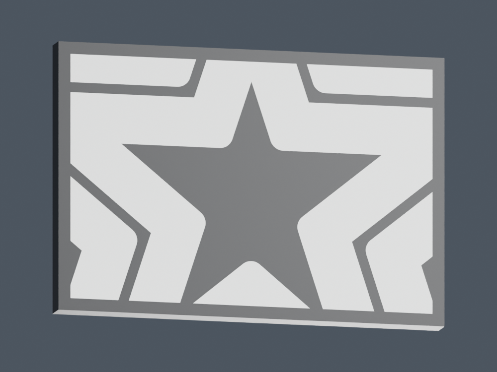
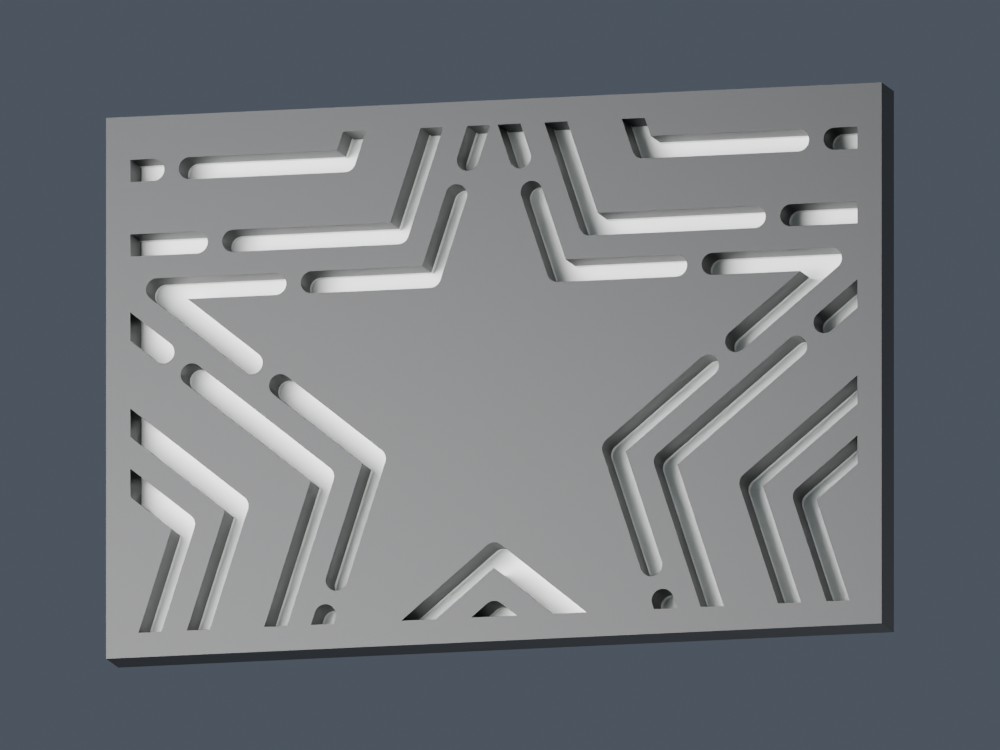

This variant has **three continuous white star bands**, with no black outlines around the bulbs. All **130 original bulb shapes** remain as hidden light windows behind a **0.4 mm white skin**, flush with the front face. The surrounding white is 1 mm thick, with black backing from Z = 1 mm behind it to keep the illuminated pattern distinct. At the supplied 0.20 mm layer height, each bulb window has two printed layers.

The face prints down against the plate. The white bands and thin windows now form three connected white solids instead of 133 separate pieces. The combined shell geometry, bulb positions, and outside dimensions match the preceding diffused version; this revision transfers the visible black bulb outlines to white.

The 200 mm outline, 60 mm depth, 100 mm bottom entrance, and preferred two-dot connector are retained. Use the marked back from [../two_dot/snap_back_A1.3mf](../two_dot/snap_back_A1.3mf). Its inset `christopherbrown.io` mark remains 72 mm wide and 1 mm deep. The original release and earlier open-window designs are preserved.

- [diffused_front_A1.3mf](diffused_front_A1.3mf): full front shell, white on project filament 1 / AMS A1 and black on project filament 2 / AMS A2.
- [diffuser_test_A1.3mf](diffuser_test_A1.3mf): 64 × 44 × 4 mm sample at actual scale, with six complete windows and further cropped windows from the real face. A 2 mm black handling border joins the sample and provides larger edges for removal.
- [diffused_topper.blend](diffused_topper.blend): editable Blender scene containing the full topper and the test sample.
- [parameters.json](parameters.json), [mesh_validation.json](mesh_validation.json), [slicer_validation.json](slicer_validation.json), and [slice_comparison.json](slice_comparison.json): dimensions, independent geometry checks, actual test toolpaths, and native slice estimates.

Bambu Studio 02.05.00.66 sliced both the full front and sample for the A1 with a 0.4 mm nozzle, Generic PLA, 0.20 mm layers, no supports or brim, and a prime tower. Exported G-code uses Textured PEI at 65 °C. Estimates include startup, purging, and the slicer's timelapse allowance:

| Project | Estimated time | Filament |
| --- | ---: | ---: |
| Previous outlined diffused front, commit `8bfcef2` | 3 h 50 min 58 sec | 95.32 g |
| Continuous white front | 3 h 55 min 24 sec | 95.01 g |
| Continuous white test sample | 51 min 37 sec | 12.90 g |

The full front uses 0.31 g less filament and takes an estimated 4 min 26 sec longer under matching settings. Removing the outlines simplifies the white geometry and appearance; the tall shell still accounts for most printing. The test has 20 layers. G-code checks verify white extrusion on layers 1 and 2 only in each of its six intact windows, no black extrusion inside those windows, and no black paths inside the continuous white star faces on the first two layers. Buffered toolpaths cover approximately 97.7% and 98.1% of the star-band interiors; this is a path-width approximation, not a measurement of the printed surface.

The **preceding outlined sample** was sent on 2026-10-04 to printer **3DP-039-922** as **Star_diffuser_test_0.4mm**, with white in physical A1 and black in A2. It continues to test the same two-layer white windows. Its print evidence is preserved in [outlined_test_print.json](outlined_test_print.json), [outlined_test_mesh_validation.json](outlined_test_mesh_validation.json), and [outlined_test_artifact_hashes.json](outlined_test_artifact_hashes.json); its model files are recoverable from commit `8bfcef2`. Completion and physical optical results are pending.

The revised sample is prepared separately and has **not been sent while the earlier sample occupies the plate**. The requested physical materials remain **white in A1 and black in A2**. A1's saved registration still reports magenta PLA Silk. A temporary sending copy uses that nominal color to let Bambu select A1, with identical geometry and Generic PLA extrusion settings. Both physical slots were verified in the send dialog, which reports the printer is busy. The revised sample is left sliced in Bambu Studio; [print_preparation.json](print_preparation.json) records that preparation. The canonical projects and previews remain white and black. Verify physical slots before sending and clear the finished print from the plate.

The membranes and complete front form one connected print. Dimensions, material boundaries, exported meshes, native slicing, and Blender triangle intersections have been checked. Actual brightness, diffusion, and unlit appearance require inspecting the physical sample with the intended lights. The assembled full topper and the force of all six clips remain to be tested.

To rebuild, run `python3 snap_back_prism/diffused/prepare.py`. Send `build_blender.py` through Blender MCP and call `setup()`, `build()`, and `finish()`. Run `validate_and_package.py`, then reimport the canonical meshes through Blender MCP with `restore()` and `import_canonical()`. The rear cover is imported directly from the preferred two-dot revision. Render the actual meshes with `preview_blender.py`, `setup_studio()`, `render_diffused()`, and `finish()`.

After slicing the sample, export the plate sliced file in Bambu Studio and run `python3 snap_back_prism/diffused/audit_sliced_test.py /absolute/path/to/sample.gcode.3mf`. This checks the material and layer count from actual extrusion instructions. Re-slice every changed project before printing.

Original model and adaptation: christopherrbrown3 / christopherbrown.io, CC BY-NC-SA 4.0. See the repository's `LICENSE`.
