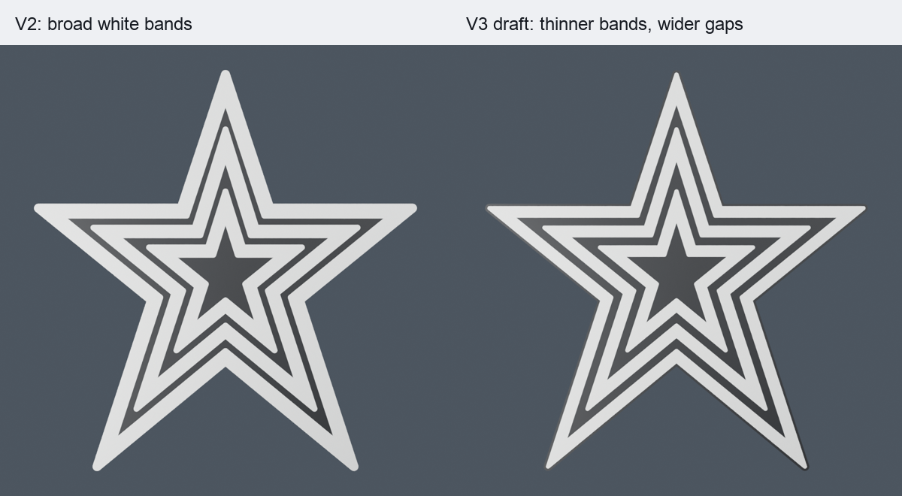

# Thinner star frames, spacing draft v3

This draft reduces the white band widths and widens the visible black gaps after comparison with the supplied daylight aerial photograph. The three white bands now have similar widths. A narrow black border, approximately 1.2 mm wide along straight edges, surrounds the outside star.

| Measurement | V2 | V3 draft |
| --- | ---: | ---: |
| Outer white band at shoulder | 7.34 mm | 5.74 mm |
| Middle white band at shoulder | 6.59 mm | 5.79 mm |
| Inner white band at shoulder | 6.46 mm | 5.66 mm |
| Outer-to-middle clear gap at shoulder | 3.19 mm | 3.99 mm |
| Middle-to-inner clear gap at shoulder | 3.27 mm | 4.07 mm |
| Closest outer-to-middle gap anywhere | 2.06 mm | 2.86 mm |
| Closest middle-to-inner gap anywhere | 2.64 mm | 3.44 mm |

The photograph suggests roughly 9–10 pixels of frame width and 8 pixels of open gap at the measured horizontal shoulder. These are approximate readings from a perspective photograph, recorded in `photographic_band_measurements.json`; they are not surveyed dimensions. The model's gaps vary around the star because the established nested paths are retained. This draft changes the white backing margin around those paths, rather than changing their proportions again.

All six light-track paths and all 130 hidden window polygons are identical to V2. The windows retain their 0.4 mm white diffuser floors, and the unlit face has three continuous white stars without individual black bulb outlines. The fused shell geometry, 100 mm tree entrance, six catches, and marked two-dot back are also retained. The back STL and its print project are byte-identical to the previous back; its inset `christopherbrown.io` mark is 72 mm wide and 1 mm deep.

## Files to use

- `front_shell_A1.3mf`: two-material front shell, positioned face down; project filament 1 is white for A1, and filament 2 is black for A2.
- `roanoke_star_spacing_v3.blend`: editable Blender scene with the new front, matching back, and render lighting.
- `snap_back_A1.3mf`: matching all-white back. The previously printed marked two-dot back remains compatible.
- `body_black.stl` and `body_white_diffused.stl`: separate material meshes in their assembled coordinates.
- `front_shell_fused.stl`: the unchanged single-material geometry reference. Use the front 3MF for the intended colors.
- `previews/front.png`, `previews/assembled.png`, and `previews/spacing_comparison.png`: renders of the exported meshes.

## Verification

The black and white material meshes pass watertightness and positive-volume checks. Live Blender reports zero boundary edges, zero non-manifold edges, and zero nonadjacent triangle intersection candidates for the front materials and back. The seated back has no measured solid collision. Hash comparison confirms that all 160 protected earlier files, including V2, remain unchanged.

Native Bambu Studio slicing uses the A1 with a 0.4 mm nozzle, 0.2 mm layers, a 65 C textured PEI plate, two Generic PLA profiles, a prime tower, and no supports or brim. The front slice has 292 layers and reaches 58.4 mm. Its estimate is 3 hours 50 minutes 46 seconds and approximately 94.83 g, including flushing and the tower.

An independent audit of the first 20 layers checks the three continuous white bands and all 130 window interiors. Each window receives white on exactly layers 1 and 2, with no black extrusion in its audited interior. Buffered toolpaths with rounded bead ends approximate deposited coverage; the audited window cores exceed 90% coverage on each layer, 99% on layer 2, and 99.9% across both layers. This is a toolpath check, not a physical translucency or airtightness test.

See `mesh_validation.json`, `blender_validation.json`, `slicer_validation.json`, and `preservation_validation.json` for the checks and hashes. This spacing revision has been rendered and sliced; it has not been sent to the printer or physically tested.

## Regeneration

From the repository root, run `python3 snap_back_prism/spacing_v3/build.py`. Dependencies are `numpy`, `trimesh`, `manifold3d`, `shapely`, and `mapbox_earcut`. The script reads the V2 source and geometry snapshot files included in `../proportions_v2/`, plus earlier geometry helpers, and writes only this revision directory. Its default is three thinner white bands with the narrow black outside border. The optional `--keep-white-outer-edge` flag restores the earlier white outside edge while retaining the thinner two inner bands; that alternative requires fresh renders, a native slice, and a new audit.

For Blender MCP, submit the contents of `build_blender.py` as Python code, followed by `setup()`, `validate()`, `studio()`, `render_front()`, `render_assembled()`, and `save()`. If the revision scene already exists, use `restore()` and `reload_meshes()` instead of `setup()`, and reuse the existing studio. The code runs directly in Blender's safe mode without a file-reading or `exec` wrapper.

After exporting the native Bambu slice, run `python3 snap_back_prism/spacing_v3/audit_slices.py /path/to/plate.gcode.3mf`. The slicer report applies only to the front 3MF identified by `source_front_sha256`; rebuilding geometry requires slicing and auditing the current project again.
