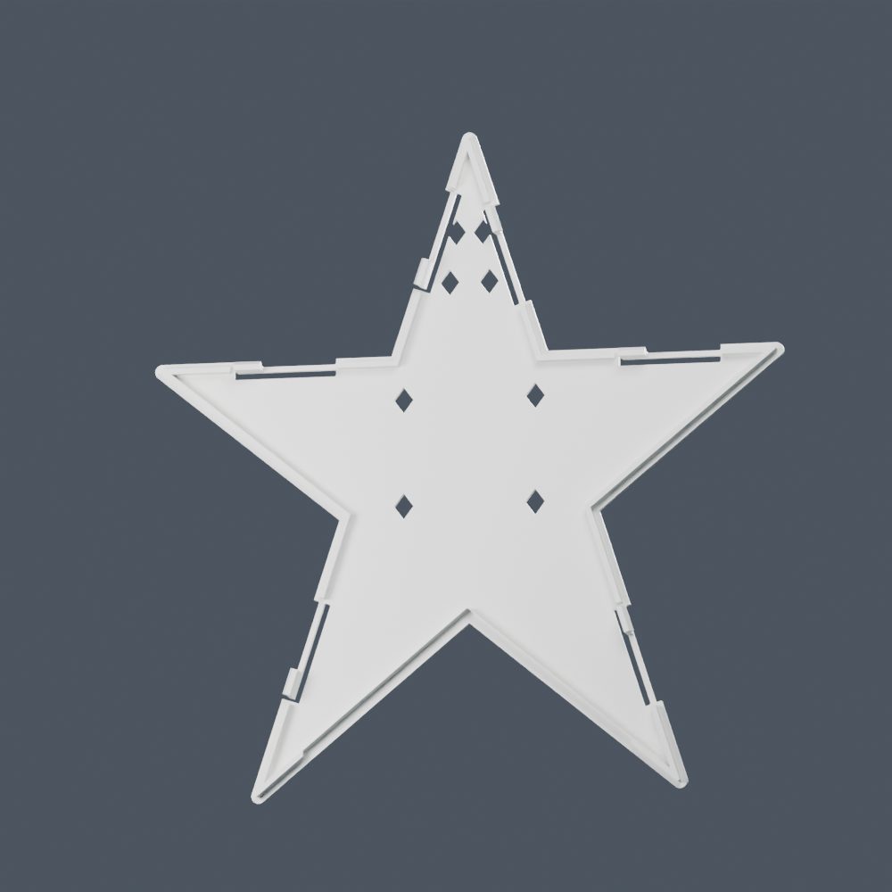

This is the full topper revision using the **two-dot connector** that the user slightly preferred after both test pairs worked. The original release, one-piece prism, earlier snap-back experiment, and printed test pairs are preserved.

The front retains the same 200 mm face, original white bands, and 130 light apertures. The star remains 60 mm deep with the same 100 mm bottom opening. The back has six 30 mm cantilever arms, 1.6 mm bending width, 2 mm relief, 8 mm hooks, 0.55 mm guide clearance, and 0.50 mm engagement. The shell has matching 9.2 mm catch windows. The hook meshes are direct transforms of the tested two-dot hook.

Bambu Studio 02.05.00.66 sliced both matching plates for the A1, 0.4 mm nozzle, Generic PLA, and 0.20 mm layers:

| Plate | Estimated time | Filament |
|---|---:|---:|
| Front shell | 3 h 39 min | 92.59 g |
| Detachable back | 56 min 57 sec | 29.12 g |
| **Total** | **About 4 h 36 min** | **121.71 g** |

Times include startup for both plates. Neither requires supports. The front has a 4 mm brim and a purge tower for its face colors; the back has neither. See [slicer_validation.json](slicer_validation.json) for package hashes and observed results. The new full topper has not been sent to the printer.

- [front_shell_A1.3mf](front_shell_A1.3mf): matching front shell, face down; navy on project filament 1 and original white bands on project filament 2.
- [snap_back_A1.3mf](snap_back_A1.3mf): matching back, outer face down with clips up; white on project filament 2.
- [two_dot_topper.blend](two_dot_topper.blend): separate editable scene built through Blender MCP.
- [parameters.json](parameters.json) and [mesh_validation.json](mesh_validation.json): dimensions, coupon comparisons, mesh integrity, assembly clearance, and package checks.

Use both plates from this directory. The wider hooks require these matching shell windows. Map project filaments to the desired physical AMS slots before sending a full print. The successful individual test used slot A1, synced as Generic PLA Silk, magenta; the supplied full topper projects retain the original navy/white color scheme.

The individual connectors worked in the user's physical test. The assembled full topper and combined force of its six latches still need a physical check. Assembly, tree opening, and deflected-hook corridor checks are geometric checks; they do not predict force. Thermal and incandescent-light compatibility remain unverified.

Rebuild by running `python3 snap_back_prism/two_dot/prepare.py`, then send the definitions in `build_blender.py` through Blender MCP: call `setup()` and `build_body()`, then resend the definitions, call `restore()`, `build_back()`, and `finish()`. Run `validate_and_package.py`, then reimport its cleaned STLs through `restore()` and `import_canonical()`. Re-slice both packages in Bambu Studio after any geometry change.

Original model and adaptation: christopherrbrown3 / christopherbrown.io, CC BY-NC-SA 4.0. See the repository's `LICENSE`.
